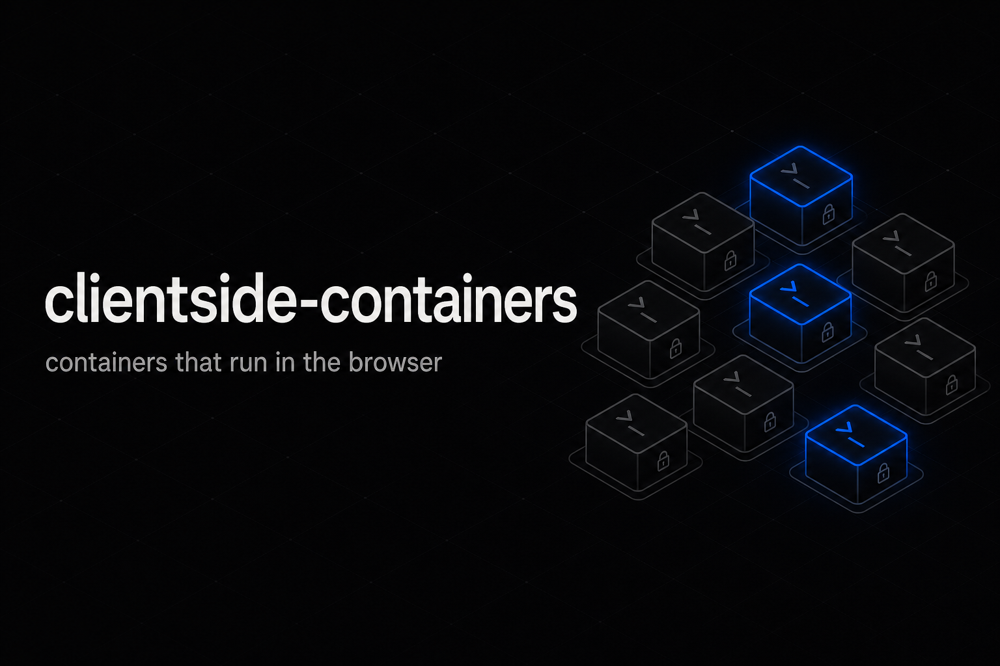
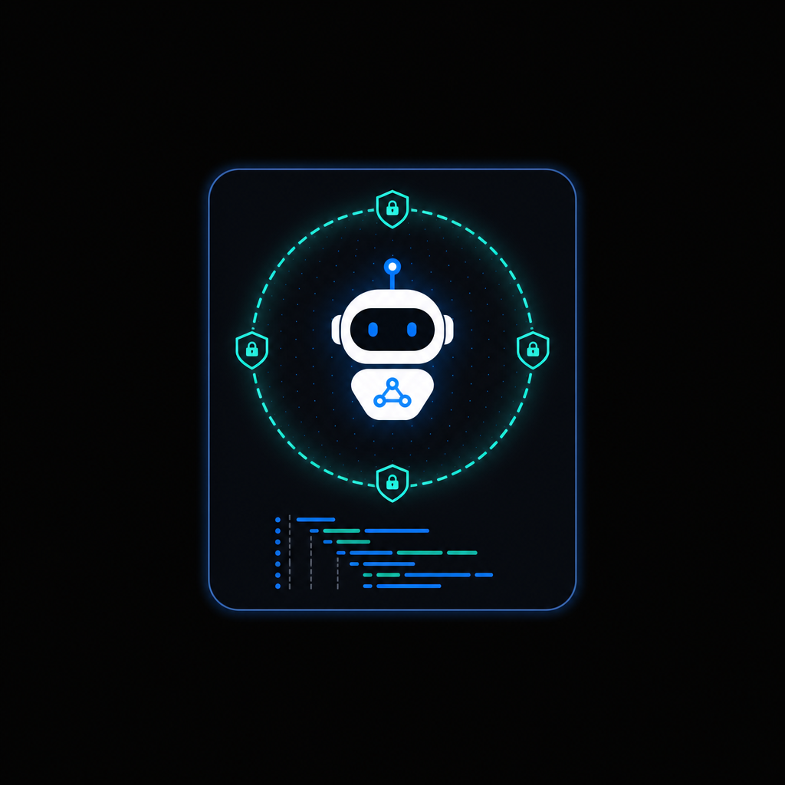
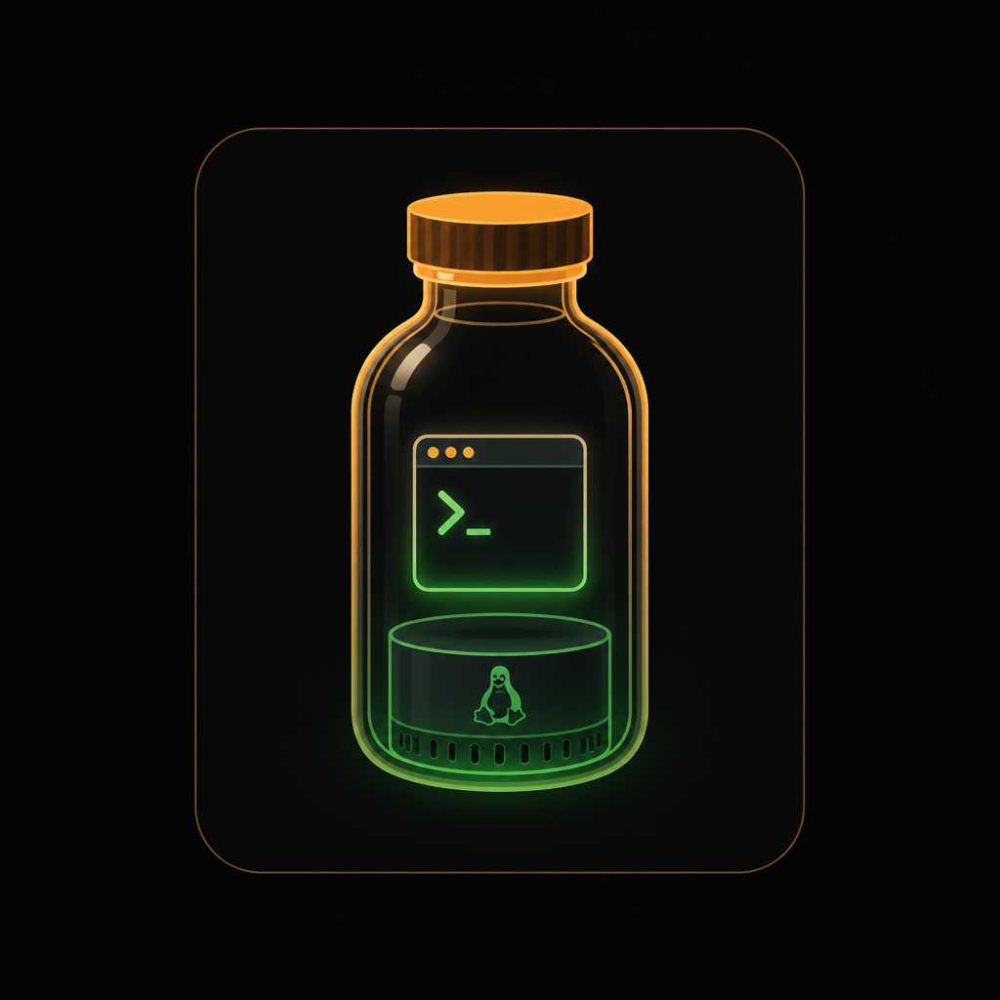
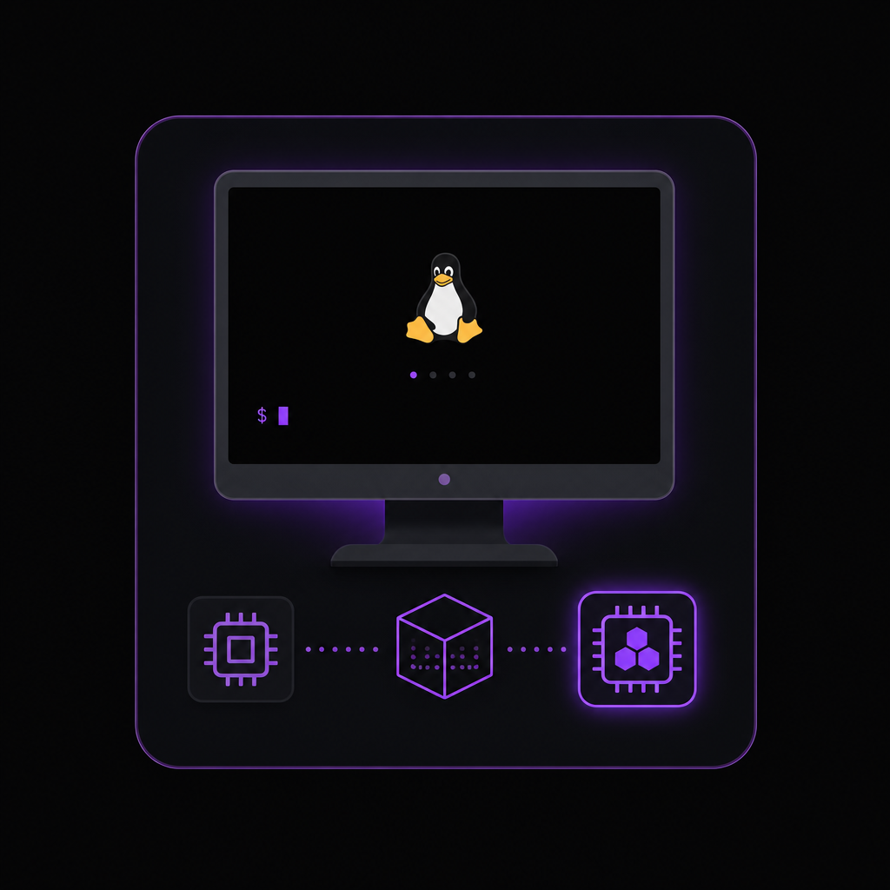
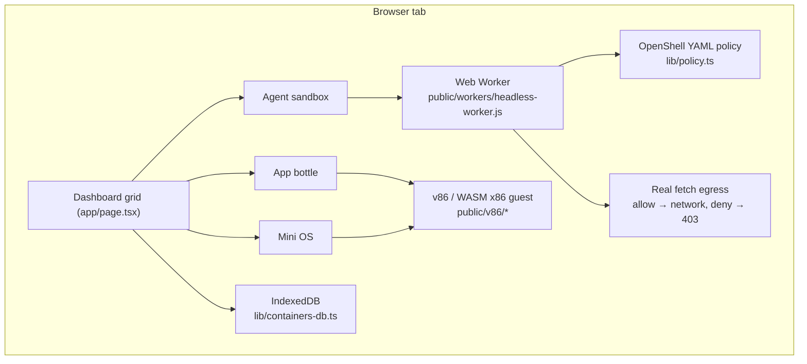

<p align="center">
  
</p>

# clientside-containers

Containers that run **entirely in your browser**. No server, no backend, no
simulation — open the page and you get a dashboard of containers you can start,
open, and configure, all executing client-side.

The site that runs on GitHub Pages is the real app. There is no difference
between hosting it yourself (Vercel, S3, your laptop) and the published page —
it is a static bundle and every container runs in the visitor's tab.

**Live:** https://thyfriendlyfox.github.io/clientside-containers/

## What it is

The dashboard is a grid of containers. Each card opens into an interface (like a
remote desktop, but for that container), and each card has a settings gear for
per-container configuration. The tiers are a spectrum sized by how much OS you
need — the smallest is the NVIDIA agent runtime:

<p align="center">
  
  
  
</p>

| Tier | What runs | Interface |
| --- | --- | --- |
| **Agent sandbox** | The OpenShell runtime for autonomous agents ([NemoClaw](https://github.com/NVIDIA/NemoClaw) + [OpenShell](https://github.com/NVIDIA/OpenShell)), in a **Web Worker**, governed by a declarative YAML policy. Allowed egress is a real browser `fetch`; denials and CORS failures are reported honestly. | Policy editor + API/egress console. |
| **App bottle** | A single program inside a minified Linux. | The program's terminal. |
| **Mini OS** | A full **minified Linux** booted in your browser (real x86 via WebAssembly). | The Linux screen + shell. |

OpenShell is the runtime for autonomous AI agents, but it normally requires a
supported host plus a local runtime (Docker, Podman, or MicroVM virtualization).
clientside-containers removes that barrier: the agent runtime — and
progressively larger minified OSes — run in the browser, on any device.

The Mini OS and App tiers boot a real Linux kernel with [v86](https://github.com/copy/v86),
an x86 emulator compiled to WebAssembly. The kernel, BIOS, and WASM engine are
served as static assets from `public/v86/`, so there is nothing to install.

### Preconfigs

The **New container** dialog offers preconfigured choices per tier:

- **Agent presets** — OpenClaw, NanoClaw, Hermes, Claude Code, Gemini CLI, Grok
  Code, Cursor, and Cursor CLI. Each ships an OpenShell policy whose network
  allowlist matches that agent's APIs (e.g. `api.anthropic.com`,
  `generativelanguage.googleapis.com`, `api.x.ai`, `api2.cursor.sh`).
- **OS images** (Mini OS) — Buildroot Linux, **Ubuntu 10.04 Desktop** (GNOME live
  CD, fetched at build/deploy time), and a miniature **Windows 1.01** (1.47 MB
  floppy). Windows and Buildroot are bundled under `public/v86/`; Ubuntu is
  downloaded by `npm run fetch-v86-images` (or CI) so the ~694 MB image stays
  same-origin without bloating git history.
- **Configs** (App bottle) — a config is a sequence of commands the container
  runs in the guest after boot (provisioning). Includes an interactive shell, a
  `system-info` config, and an **OpenTTD** config that installs and launches
  OpenTTD in the container. (The bundled minimal Linux can run shell configs;
  launching a GUI app like OpenTTD needs a desktop-capable image.)

## How it works

Everything below runs inside the visitor's browser tab. The dashboard renders a
grid of containers; each tier maps to a real client-side runtime, and state is
kept in IndexedDB so containers survive reloads.



```
app/
  layout.tsx        Minimal root layout
  page.tsx          Renders <Dashboard />
components/
  Dashboard.tsx     The container grid, new/settings/open orchestration
  ContainerCard.tsx A grid cell — click to open, gear for settings
  ContainerStage.tsx Full-screen interface for an opened container
  SettingsModal.tsx Per-container settings (memory, networking, autostart)
  NewContainerMenu.tsx Pick a tier and create
  runtime/
    EmulatorScreen.tsx  Mounts v86: serial terminal (Linux) or VGA (Windows)
    AgentConsole.tsx    Agent tier: YAML policy editor + honest-egress console
lib/
  container.ts      Container model, tiers, bottled-app catalog
  containers-db.ts  IndexedDB persistence (containers survive reloads)
  agents.ts         Agent presets + per-agent OpenShell policies
  os-images.ts      Mini OS image catalog (Buildroot, Ubuntu desktop, Windows 1.01)
  configs.ts        App-tier configs: command sequences run in the container
  policy.ts         OpenShell policy: parse / serialize / evaluate egress
  v86-runtime.ts    Loads the v86 engine and boots the guest
  base-path.ts      Base path for static assets under a sub-path
public/
  v86/              v86 engine (libv86.mjs, v86.wasm), BIOS, Linux bzImage
  workers/          headless-worker.js (agent runtime + real fetch egress)
```

State (your containers and their settings) is stored in **IndexedDB**, so it
persists across reloads in that browser.

## Getting started

```bash
npm install
npm run dev
```

Open <http://localhost:3000>.

### Build

```bash
npm run build            # server-capable build
STATIC_EXPORT=true npm run build   # static export to out/
```

### Scripts

| Script | Purpose |
| --- | --- |
| `npm run dev` | Dev server. |
| `npm run build` | Production build (`STATIC_EXPORT=true` for static export). |
| `npm run lint` | ESLint. |
| `npm run typecheck` | TypeScript. |
| `npm run fetch-v86-images` | Download large v86 disk images (Ubuntu desktop ISO). |

## Notes

- The minified Linux is a small Buildroot image (~10 MB) fetched once from the
  same origin on first boot, then cached by the browser.
- `PAGES_BASE_PATH` sets the base path when serving under a sub-path (e.g.
  `/clientside-containers` on GitHub Pages); it is inlined for client-side asset
  URLs as `NEXT_PUBLIC_BASE_PATH`.

## Roadmap

The scope is open-ended: bring the ease of cloud-agent hosting into the browser,
in isolated environments, for any agent, app, or OS, on any device. See
[ROADMAP.md](./ROADMAP.md) for the horizons — from making each tier more real to
orchestrating, snapshotting, and sharing containers. It is a living document with
no defined end.

## License

GPL-3.0-only. See [LICENSE](./LICENSE). Includes [v86](https://github.com/copy/v86)
(BSD-2-Clause) assets under `public/v86/`.
