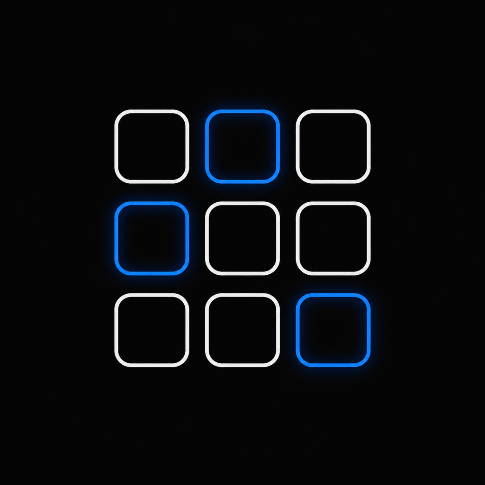
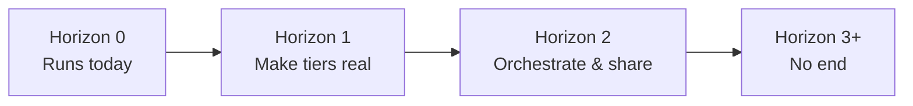

  

# Roadmap

The goal is singular and open-ended: **bring the ease of cloud-agent hosting to
the local browser, in isolated environments — for any agent, any app, any OS, on
any device.** Cloud platforms make it trivial to spin up an isolated box and run
something in it. This project pulls that ergonomics into the visitor's tab, with
no server behind it.

This roadmap has **no defined end**. It is a set of expanding horizons, not a
checklist that completes. Every horizon makes the tiers more real, the isolation
stronger, and the spectrum of what you can run wider. When an item ships, the
horizon moves — it does not close.

## How to read this

- Horizons are ordered by dependency and confidence, not by calendar date.
- Anything in **Horizon 0** exists today. Everything past it is directional.
- Each step should still pass the same bar: client-side only, no simulation,
  same-origin assets, and green builds. See the principles below.

## Principles (do not regress)

These are inherited from [AGENTS.md](AGENTS.md) and gate every item on this list:

- **Client-side only.** No server, no backend, no API route the UI depends on.
  GitHub Pages and self-hosting behave identically.
- **No simulation.** A tier must actually execute (Web Worker, v86/WASM), never
  fake its output.
- **The app is the grid.** Root `/` is the dashboard; no marketing pages.
- **Assets are same-origin.** Runtimes are bundled under `public/`; nothing a
  container needs to boot comes from a CDN.
- **Keep it green.** typecheck + lint + server build + static export all pass.

## Horizon 0 — Runs today

The foundation is already live in the browser:

- **Agent sandbox** — the OpenShell agent runtime in a Web Worker, governed by a
  declarative YAML policy, with a policy editor and an API/egress console.
- **App bottle** — a single program inside a minified Linux, provisioned by a
  config (command sequence) after boot.
- **Mini OS** — a full minified Linux booted with v86 (real x86 via WASM):
  Buildroot, Ubuntu 10.04 desktop, and Windows 1.01.
- **Persistence** — containers and their settings survive reloads via IndexedDB.
- **Preconfigs** — agent presets, OS images, and app configs in the New
  Container dialog.

## Horizon 1 — Make each tier more real

Depth over surface area. Take what exists and make it genuinely capable.

- **Honest egress.** The agent worker performs the `fetch`es its policy allows,
  surfaces CORS results truthfully, and denies the rest by policy — no faked
  network responses.
- **Boot straight into an app.** App bottles launch their program on boot and
  present its terminal directly, skipping the generic shell.
- **More bottled apps.** Grow the app catalog beyond the current set.
- **Resume where you left off.** Persist and restore v86 state (`save_state`) so
  a Mini OS resumes instead of cold-booting.
- **Desktop-class images.** A larger, desktop/Xorg-capable tier behind the same
  grid UX, so GUI apps (e.g. OpenTTD) have somewhere real to run.
- **Opt-in networking for v86.** virtio plus a relay as an explicit,
  off-by-default setting.

## Horizon 2 — Orchestrate, snapshot, and share

Move from single containers to a workspace of them.

- **Multi-container orchestration.** Run several containers at once on the grid;
  let an agent drive an app bottle or a Mini OS as a tool.
- **Snapshot / export / import.** Capture a container (state + config) to a file
  and restore or share it, so a setup is reproducible on any device.
- **Richer policy tooling.** Visual policy building, presets, and live
  explanations of what a policy allows or denies.
- **Stronger isolation primitives.** Tighten the boundary each tier runs behind
  and make the isolation model legible in the UI.
- **Living docs.** Real screenshots and short capture clips of each tier in the
  README and docs (captured from the running app, not mocked).

## Horizon 3+ — No end

The spectrum keeps widening. These are directions, not destinations:

- **An ever-growing catalog** of agents, apps, and operating systems — the tier
  spectrum expands as new runtimes become feasible in the browser.
- **Larger and richer OS images** as browser capabilities and compression allow.
- **Cross-device reach** — the same grid, the same containers, on phones,
  tablets, and desktops, with layouts that fit each.
- **New runtimes** beyond v86 and Web Workers as the platform evolves (Wasm
  system interfaces, threads, GPU) — each held to the no-simulation bar.
- **An open contribution model** so agents, apps, images, and configs can be
  added by anyone, keeping the catalog and the isolation model growing
  indefinitely.

The list above is deliberately unfinished. When we reach the edge of a horizon,
we draw the next one.

## Contributing to the roadmap

Follow the development loop in [AGENTS.md](AGENTS.md): pick one improvement that
moves a tier closer to real, keep the change small and shippable, keep the build
green, and open a PR. New horizons are welcome — the scope is meant to grow.
