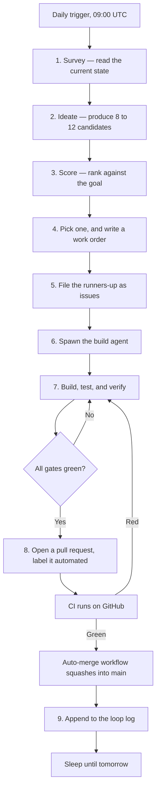

# The autonomous daily loop

This repository improves itself once a day, without a human in the path.

A scheduled session wakes up, spends up to two hours choosing the single most
valuable change, hands that change to a build agent, and lets the agent work
until the change is done. The change reaches `main` through a branch, a pull
request, a test suite, and an automatic merge.

This document is the specification for that loop. The scheduled session reads
this file first and follows it. Change this file to change the loop.

It is written in simplified technical English: short sentences, one idea per
sentence, the active voice, and no idiom.

---

## 1. What the loop is for

The loop exists to move the repository toward one goal:

> **The easiest and fastest way to try any AI system, any app, on any
> environment, on any device — entirely in the browser.**

Every cycle must produce **one major update**. A major update is a change a
user would notice and describe in one sentence. These all count:

- A tier becomes able to do something it could not do before.
- A serious fault stops happening.
- A slow thing becomes fast enough to change how the app feels.

These do **not** count as the cycle's major update:

- A change to comments, formatting, or documentation alone.
- A dependency bump. Dependabot already does that.
- A rename or a move with no change in behaviour.

Small cleanups may ride along with the major update. They cannot replace it.

---

## 2. Shape of the loop



Steps 1 to 5 are the **selection phase**. They have a budget of two hours. Steps
6 to 9 are the **build phase**. It runs until the goal is met, with no time
budget.

---

## 3. Selection phase — up to two hours

The selection phase is the part that must not be rushed. A cycle that builds the
wrong thing well is worse than a cycle that builds nothing.

### 3.1 Survey — read the current state

Gather all of this before you think about ideas:

| Source | What to take from it |
| --- | --- |
| `docs/loop-log.md` | Every past cycle. Never repeat one. Read the "Follow-up" lines. |
| `ROADMAP.md` | The declared horizons. |
| `AGENTS.md` | The constraints, and the "Good next steps" list. |
| Open GitHub issues | What users actually ask for. A user request outranks your own idea. |
| Open CodeQL alerts | Real security findings. |
| Recent commits on `main` | What just changed, and what it made possible. |
| The last 7 CI runs | A test that fails at random is a major problem. Fix it. |
| The app itself | Run `npm run dev`. Create a container of each tier. Look for what is broken or missing. |

### 3.2 Ideate — produce 8 to 12 candidates

Write between 8 and 12 candidate changes. Do not stop at 3. The value of this
phase comes from the range of ideas, not from the first idea.

Cover all four of these kinds. Do not let one kind fill the whole list:

1. **Make a tier more real.** The agent tier, the app tier, or the Mini OS tier
   does something it currently only half does.
2. **Remove friction.** A user reaches a working container in fewer steps, or in
   less time.
3. **Fix a major problem.** A fault, a slow path, a security finding, or a piece
   of the app that is dead code.
4. **Reach further.** A device, a browser, an agent, an app, or an OS that does
   not work today.

Write each candidate in one sentence, in the user's words, not in the code's
words.

> Good: "A Mini OS container resumes where it left off after a page reload."
>
> Bad: "Call `save_state` in `v86-runtime.ts`."

### 3.3 Score — rank against the goal

Score every candidate from 1 to 5 on each axis. Multiply nothing. Add the four
numbers.

| Axis | Question | 1 | 5 |
| --- | --- | --- | --- |
| **Goal** | How far does it move the product goal? | Barely | It changes what the product is |
| **Reach** | How many users meet it? | A rare case | Everyone, on the first screen |
| **Proof** | Can a test prove it works? | Only a human can see it | A unit test proves it |
| **Fit** | Does it fit one cycle? | It needs many cycles | One agent can finish it today |

Then apply these rules in order:

1. **Reject** any candidate that breaks a hard constraint in section 6. Score
   does not matter. A rejected candidate is not built, ever.
2. **Promote** any candidate that fixes a confirmed security fault or a test
   that fails at random. Safety and a trustworthy gate come first.
3. **Promote** any candidate that an open user issue asks for, when its score is
   within 2 points of the top score.
4. Otherwise take the highest total. Break a tie by taking the smaller change.

### 3.4 Pick one, and write a work order

Write a work order for the winner. The build agent gets only this text, so it
must stand alone. Use this template:

```markdown
## Goal
<One sentence. What a user can do after this change that they cannot do now.>

## Done when
- [ ] <A condition a person can check by using the app.>
- [ ] <Another. Between 2 and 5 of these.>

## Constraints
<Any constraint from section 6 this change comes close to, and how to keep it.>

## Where to start
<The files and functions that are involved. Read them before you plan.>

## Out of scope
<What not to touch. This stops the change from growing.>

## Verification
- `npm run typecheck`
- `npm run lint`
- `npm test` — with a new test that fails before the change and passes after it
- `npm run build`
- `STATIC_EXPORT=true PAGES_BASE_PATH=/clientside-containers npm run build`
- `bash scripts/check-static-export.sh /clientside-containers`
- Manual: <the browser steps that prove the "Done when" list>
```

### 3.5 File the runners-up as issues

Open a GitHub issue for every candidate that scored 12 or higher and did not
win. Label it `enhancement` and `loop-candidate`. Put its score table in the
body.

This makes the brainstorm visible to humans, and it gives the next cycle a
warm start. Do not open a duplicate issue: search first.

---

## 4. Build phase — until the goal is met

### 4.1 Spawn the build agent

Spawn one agent. Give it the work order, plus this instruction:

> Work until every box in "Done when" is ticked and every command under
> "Verification" passes. Do not report success while any check fails. If the
> approach turns out to be wrong, say so and stop. Do not silently build
> something else.

### 4.2 What the build agent does

1. Branch off the current `main`:
   `git checkout -b loop/<yyyy-mm-dd>-<short-name>`
2. Read the files named in "Where to start" before writing any code.
3. Write the test first, where the logic is pure. Confirm the test fails.
4. Implement the change.
5. Run every command in "Verification". Fix what fails. Repeat until all pass.
6. Run the manual browser check.
7. Commit in logical chunks, using Conventional Commits.
8. Push the branch.

### 4.3 Rules the build agent must keep

- **Never weaken a gate to make it pass.** Do not delete a test, do not skip a
  test, and do not loosen a type to silence an error. If a gate is wrong, that
  is the next cycle's work, and it needs its own pull request.
- **Never widen the scope.** Anything outside "Done when" becomes a follow-up
  note, not a commit.
- **Stop after 3 failed attempts at the same error.** Record what was tried, mark
  the cycle as blocked, and file an issue. A blocked cycle is an honest result.
  A broken merge is not.

---

## 5. Ship phase

### 5.1 Open the pull request

The title is the Conventional Commit subject of the change.

The body is written by the loop, not copied from the template. It has these
sections:

```markdown
## What this changes
<One or two sentences, in the user's words.>

## Why it was chosen
<The score, and the one line that made it beat the runners-up.>

## How it works
<The approach. Any decision a reviewer would question.>

## Verification
<Every command that ran, and its result. Every manual step, and what happened.>

## Risk
<What could break, and how a reader would notice. Or "None known".>

## Follow-ups
<What was left out on purpose. Link the issues that were filed.>

---
Cycle <n> of the autonomous daily loop. See docs/autonomous-loop.md.
```

Add the `automated` label. Without that label the pull request never merges by
itself.

### 5.2 The merge gate

`.github/workflows/auto-merge.yml` merges the pull request. It merges only when
**all** of these hold:

1. The `CI` workflow finished with the conclusion `success`.
2. The pull request carries the `automated` label.
3. The head branch belongs to this repository, not to a fork.
4. The head commit is still the exact commit CI verified.
5. The pull request is open, is not a draft, and has no merge conflict.
6. GitHub does not report the pull request as blocked.

The merge is a squash merge. The branch is deleted afterwards.

The workflow runs on `workflow_run`, so GitHub loads it from the default branch.
A pull request cannot change the rules that judge it.

### 5.3 When CI fails

Go back to the build phase. Read the failing job log, fix the cause, and push
again. Do not merge by hand. Do not remove the failing check.

If the same job fails 3 times, stop. Convert the pull request to a draft,
remove the `automated` label, and write a comment that says what is wrong.

### 5.4 Record the cycle

Append one row to `docs/loop-log.md`. Do this whether the cycle shipped, was
blocked, or was abandoned. The log is how the next cycle avoids repeating this
one.

---

## 6. Hard constraints

These are not preferences. A change that breaks one of them is rejected in
section 3.3 and never reaches the build phase.

| Constraint | Test for it |
| --- | --- |
| **Client-side only** | Does the interface still work with no server? Would GitHub Pages behave the same as self-hosting? |
| **No simulation** | Does the tier really execute, in a Web Worker or in v86? |
| **The app is the grid** | Is root `/` still the dashboard? Did a landing page or a side menu appear? |
| **Assets are same-origin** | Can a container boot with no CDN reachable? |
| **No reassurance copy** | Did any interface text about privacy or "local" appear? |
| **Keep it green** | Do typecheck, lint, tests, and both builds pass? |
| **Licence** | Is every new dependency compatible with GPL-3.0-only? |

---

## 7. Health of the loop

The loop watches itself. Act on these signals in the survey step:

| Signal | What it means | What to do |
| --- | --- | --- |
| 3 cycles blocked in a row | The loop cannot ship. | Make the next cycle's only job to unblock it. |
| A test fails at random | The gate cannot be trusted. | Promote a fix to the top of the ranking. |
| CI takes over 10 minutes | The loop is slow, and so is every contributor. | Make speeding up CI the cycle's major update. |
| The same idea is rejected twice | The idea is not viable as written. | Record why in the log, and do not raise it again. |
| A human reverted a merge | The gates missed something. | Add the gate that would have caught it. |

---

## 8. Where the schedule lives

The trigger is a scheduled Claude Code routine. It fires once a day at 09:00
UTC and starts a fresh session. That session reads this file and runs the loop
from section 3.1.

The loop has no end date. It runs until somebody turns the routine off.

To change the cadence, change the routine. To change what the loop does, change
this file — this file is the specification, and the routine only points at it.
