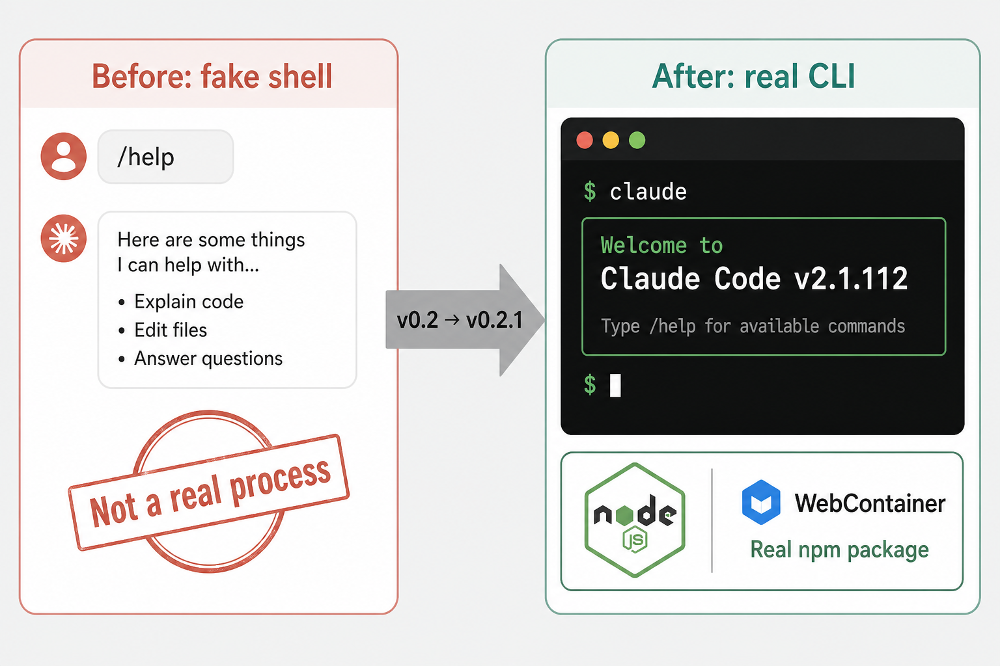
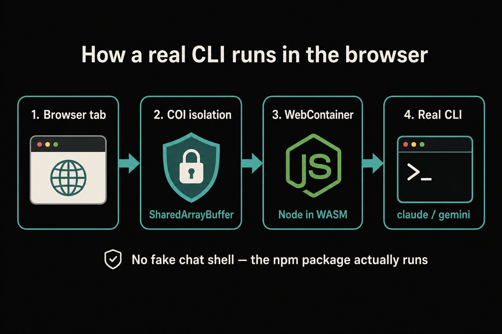
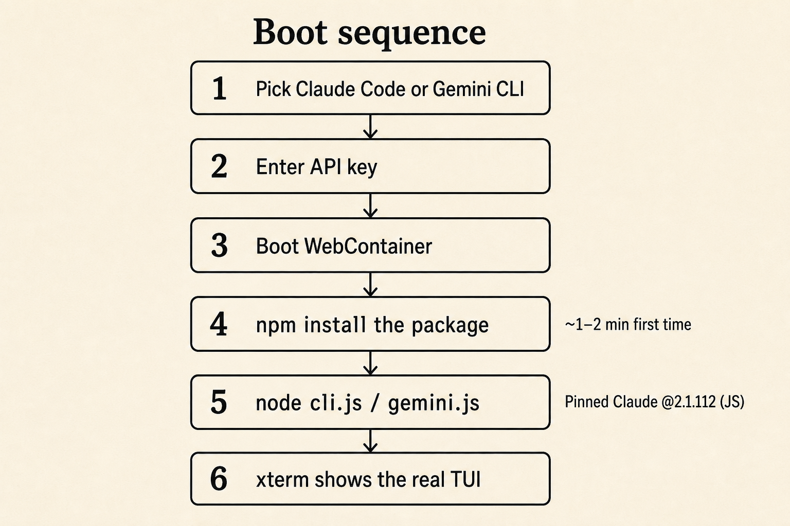
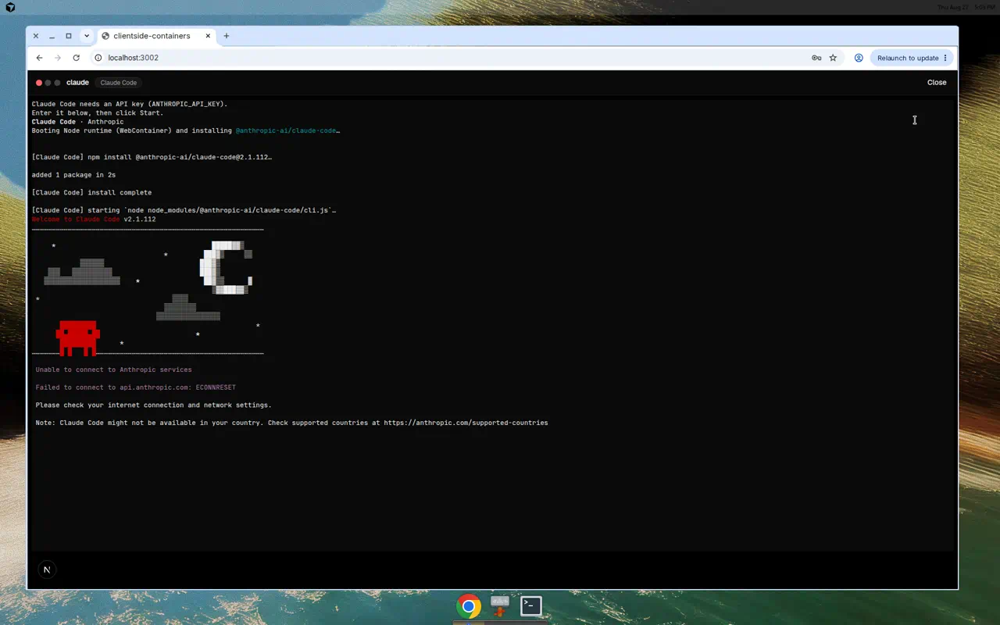
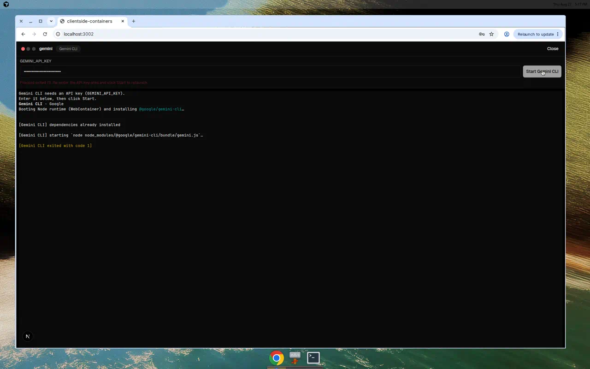

# Devlog: real CLIs in the browser (v0.2.1)

**Date:** 2026-08-27  
**Release:** [v0.2.0](https://github.com/reagent-systems/clientside-containers/releases/tag/v0.2.0) shipped the feature.
This post documents how it works and ships with **v0.2.1**.

Written in simplified technical English: short sentences, one idea per sentence,
active voice.

---

## What changed

Before this work, Claude Code and Gemini CLI looked like terminals.
They were not real.

They were chat shells.
They painted a banner.
They answered `/help`.
They called an HTTP API from a worker.
They did not run the npm packages.

Now they do.

The browser boots a Node runtime.
It installs the real packages.
It starts the real entry files.
You see the real TUI in an xterm.



---

## The big picture

Four stages sit in a chain.

1. The **browser tab** opens a container.
2. **COI isolation** turns on `SharedArrayBuffer`.
3. **WebContainer** boots Node inside the tab.
4. The **real CLI** (`claude` / `gemini`) runs as a process.



Nothing pretends to be a process.
The process is real.
It just lives in WebAssembly Node, not on your host OS.

---

## Boot sequence

When you create a Claude Code or Gemini CLI container, this happens:

1. You pick the preset.
2. You enter an API key (`ANTHROPIC_API_KEY` or `GEMINI_API_KEY`).
3. The app boots WebContainer (once per tab session).
4. It runs `npm install` for that package (first time is slow).
5. It starts `node` on the package entry file.
6. xterm shows the real TUI output.



### Package pins

| Preset | Package | Why this version |
| --- | --- | --- |
| Claude Code | `@anthropic-ai/claude-code@2.1.112` | Last release with a Node `cli.js`. Newer builds are native binaries. WebContainer cannot run those binaries. |
| Gemini CLI | `@google/gemini-cli@0.57.0` | Ships a JS bundle (`bundle/gemini.js`). |

Optional native addons (sharp, node-pty, …) are omitted on install.
WebContainer cannot load them.

---

## Why COI matters

WebContainer needs `SharedArrayBuffer`.
Browsers only give that under **cross-origin isolation**.

In `next dev` / `next start` we set:

- `Cross-Origin-Opener-Policy: same-origin`
- `Cross-Origin-Embedder-Policy: require-corp`

On static GitHub Pages we cannot set those headers.
We ship `public/coi-serviceworker.js` instead.
It rewrites responses so the page becomes isolated after one reload.

If isolation is missing, the start bar shows a clear error.
We do not fake a success.

---

## What you should see

### Claude Code

```
Booting Node runtime (WebContainer) and installing @anthropic-ai/claude-code…
[Claude Code] npm install @anthropic-ai/claude-code@2.1.112…
added 1 package in …
[Claude Code] install complete
[Claude Code] starting `node node_modules/@anthropic-ai/claude-code/cli.js`…
Welcome to Claude Code v2.1.112
```

Then the real welcome art appears.
A dummy key fails on `api.anthropic.com` with an honest network error.
That is expected.
A real key continues into the real REPL.



### Gemini CLI

```
Booting Node runtime (WebContainer) and installing @google/gemini-cli…
[Gemini CLI] npm install @google/gemini-cli@0.57.0…
…
[Gemini CLI] starting `node node_modules/@google/gemini-cli/bundle/gemini.js`…
```

The real process starts.
Auth or network faults exit with a real code.
They are not slash-command chat replies.



---

## Code map

| File | Job |
| --- | --- |
| `lib/node-cli.ts` | Package pins, env var names, key persistence |
| `lib/webcontainer-runtime.ts` | Boot WebContainer, `npm install`, spawn `node` |
| `components/runtime/NodeCliScreen.tsx` | xterm UI + start bar |
| `components/ContainerStage.tsx` | Routes Claude / Gemini to `NodeCliScreen` |
| `public/coi-serviceworker.js` | Isolation for static export |
| `next.config.mjs` | COOP/COEP headers in server mode |

Hermes stays on its own terminal UI.
Other agent presets still use the Agent Console.

---

## Limits (honest)

- First install downloads from the npm registry. It needs network.
- WebContainer’s Node runtime comes from StackBlitz’s browser Node stack (`@webcontainer/api`).
- Claude Code newer than 2.1.112 is native-only. We pin 2.1.112 on purpose.
- Provider APIs may still hit CORS from the browser. The CLI reports the real failure.

---

## Try it

```bash
npm install
npm run dev
```

Open the app.
Create an **Agent sandbox**.
Pick **Claude Code** or **Gemini CLI**.
Paste a real API key.
Watch the install, then the real TUI.

---

## Release notes pointer

Full changelog: [`CHANGELOG.md`](../../CHANGELOG.md) sections `[0.2.0]` and `[0.2.1]`.
